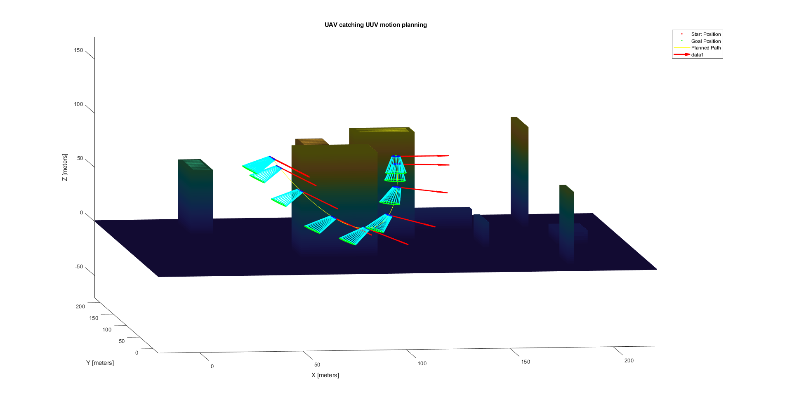
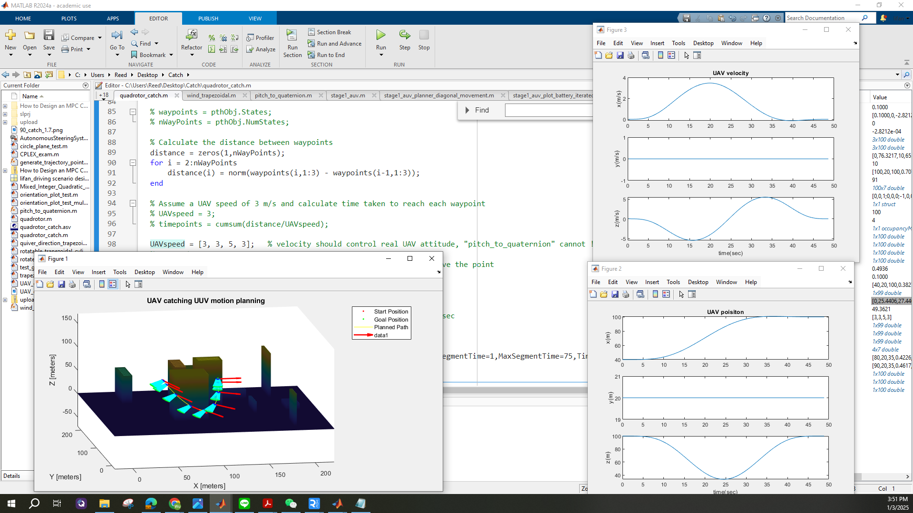

Run quadrotor_catch.m 

Input: waypoint (x,y,z,quaternion) and time

Output: min snap trajectory 

time affects flight attitude and speed

UAVspeed = [3, 3, 5, 3];   % velocity should control real UAV attitude, "pitch_to_quaternion" cannot !

Running on matlab 2024

